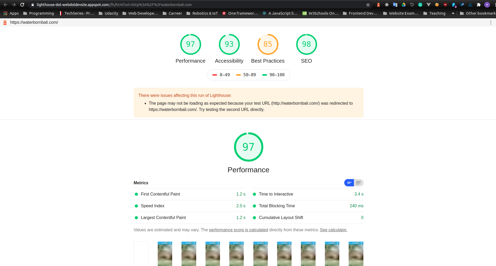

# [Waterborn Bali](https://waterbornbali.com)

A gatsby website for a surf camp/hostel in Bali. The site has lots of images, so it was important to come up with a solution to serve the images that were light, but had satisfactory image quality for the device they were viewed on. To serve a sourceset of images for different viewports I have used gatsby image plugin. Moreover, Gatsby comes with accessibility and speed baked in and uses GraphQL for the file system. This was a great learning opportunity to learn GraphQL.

The site's static content is served through AWS Cloudfront CDN, as visitors come from all over the world and it is important to serve the customers fast website in order to communicate quality.

## Performance

I have tested the site using the new web.dev/measure initiative started by Google. 

## Stability

The site has been online for 2 years without any down time.

[https://waterbornbali.com](https://waterbornbali.com)
